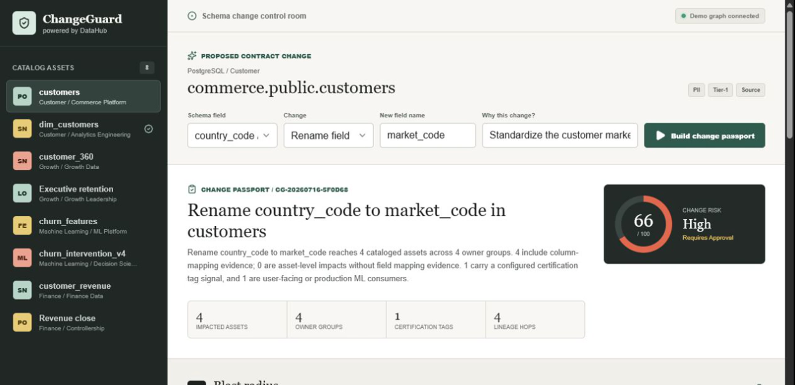

# ChangeGuard



ChangeGuard is a DataHub-grounded schema change passport agent. It turns a proposed column change into an evidence-backed blast radius, risk decision, owner routing plan, compatibility rollout, validation SQL, and durable decision record.

- [Public demo](https://iwus2xg2ulcnaeyav33ktu7pii0mcskw.lambda-url.eu-north-1.on.aws/)
- [Source repository](https://github.com/LubuSeb/changeguard-datahub)

The important distinction is that ChangeGuard does not infer the organization from a prompt. It uses DataHub's context graph through the official MCP surface:

- `get_entities` supplies ownership, domains, and tags; exact configured tag names provide a certification-tag signal.
- `list_schema_fields` prevents plans for hallucinated or stale fields.
- `get_lineage` determines the real downstream blast radius and rollout order.
- `save_document` writes the final decision back so people and future agents inherit it.

The project targets **Agents That Do Real Work** in the official Build with DataHub hackathon. It is Apache-2.0 licensed and was created during the event submission period.

## Project provenance

ChangeGuard was created from scratch during the July 6-August 10, 2026 submission period. OpenAI Codex assisted with implementation, adversarial review, validation, and media preparation. No pre-existing project code was incorporated; third-party open-source dependencies are declared in `package.json` and `package-lock.json`.

## What it does

1. Select a cataloged dataset and schema field.
2. Propose a drop, rename, type, or nullability change.
3. Ask DataHub for authoritative schema and downstream context.
4. Propagate field impact where column mappings exist and retain unknown mappings as asset-level impact.
5. Score risk from change semantics, configured certification-tag signals, governance tags, owner count, and asset type.
6. Ask a bounded local model for a structured recommendation, cited risk factors, and owner actions grounded only in those retrieved assets.
7. Reject invented assets, wrong-owner assignments, malformed output, and model failures; the model may tighten the deterministic verdict but never loosen it.
8. Produce a reversible five-phase rollout, concrete validation SQL, and owner routing.
9. Save the approved passport into DataHub's document graph.

## Run locally

Prerequisites: Node.js 24+ and npm.

```bash
npm install
npm run dev
```

Open `http://localhost:5173`. Demo mode is the default and requires no account, token, model key, or external service. It uses a rich synthetic commerce catalog. Without a configured reasoner it is explicitly labeled **deterministic preview**; the UI never presents that path as model-backed.

To run the complete agent locally without a paid API, install [Ollama](https://ollama.com/), pull an instruction model, and set:

```bash
CHANGEGUARD_REASONER=ollama
CHANGEGUARD_MODEL=qwen2.5:7b-instruct-q4_K_M
OLLAMA_BASE_URL=http://127.0.0.1:11434
npm run dev
```

When configured, the model stage is mandatory for each analysis. Timeout, malformed JSON, unknown URNs, invalid owners, duplicated phases, or other grounding failures return an error and no passport is stored. The evidence packet is hashed for provenance; prompts and model responses are not logged.

## Production build

```bash
npm run check
npm start
```

After `npm run build`, the Express server serves both the API and the compiled frontend at `http://localhost:8787`.

## Connect a real DataHub instance

ChangeGuard uses the official DataHub MCP Server with streamable HTTP transport.

```bash
DATAHUB_MODE=live
CHANGEGUARD_DEPLOYMENT=private
DATAHUB_MCP_URL=http://localhost:8080/mcp
DATAHUB_TOKEN=<personal-access-token>
CHANGEGUARD_REASONER=ollama
CHANGEGUARD_MODEL=qwen2.5:7b-instruct-q4_K_M
npm run dev
```

For DataHub Cloud, use the tenant MCP endpoint documented by DataHub:

```text
https://<tenant>.acryl.io/integrations/ai/mcp
```

The MCP server must expose `search`, `get_entities`, `list_schema_fields`, and `get_lineage`. ChangeGuard discovers tool availability before use and fails closed when a required capability is absent. Live mode is blocked under the default `public` deployment profile.

Live write-back is disabled unless all three conditions hold: the deployment is `private`, `DATAHUB_ALLOW_MUTATION=true`, and tool discovery confirms `save_document`. A successful response must include `success: true` and a real `urn:li:document:` URN before ChangeGuard returns a receipt. The token remains server-side.

The adapter parses the official response containers explicitly: `searchResults[].entity`, `result[]`, `fields[]`, and `downstreams.searchResults[]`. It does not recursively promote nested platform, tag, owner, or domain objects into catalog assets. Catalog fields are hydrated before an asset becomes selectable.

`DATAHUB_CERTIFICATION_TAGS` is an optional comma-separated list of exact, case-insensitive tag names; it defaults to `Certified`. This is only a tag-derived policy signal. ChangeGuard does not claim to read DataHub's authoritative certification aspect.

Generated SQL maps physical names by platform. DataHub PostgreSQL names in `database.schema.relation` form are rendered as `"schema"."relation"` because checks run while connected to the named database; PostgreSQL does not support a three-part relation reference. BigQuery keeps `project.dataset.table` in one backtick-quoted path. Target types are validated against the selected platform: for example, BigQuery rejects `VARCHAR(64)` and requires `STRING` or `STRING(64)`, while PostgreSQL accepts `VARCHAR(64)`.

## Docker

```bash
docker build -t changeguard .
docker run --rm -p 8787:8787 changeguard
```

For live DataHub:

```bash
docker run --rm -p 8787:8787 \
  -e DATAHUB_MODE=live \
  -e CHANGEGUARD_DEPLOYMENT=private \
  -e DATAHUB_MCP_URL=http://host.docker.internal:8080/mcp \
  -e DATAHUB_TOKEN=<token> \
  changeguard
```

## AWS Lambda public demo

The Lambda entry point is intentionally demo-only. It constructs `DemoDataHubGateway` directly, disables the model adapter, and ignores live DataHub mode and endpoint variables. The UI labels it deterministic preview. This avoids turning an unauthenticated public URL into a billable or compute-abuse surface. Demo write-back is process-local, non-privileged, and may reset between Lambda invocations.

The reviewed public deployment is available at [ChangeGuard on AWS Lambda](https://iwus2xg2ulcnaeyav33ktu7pii0mcskw.lambda-url.eu-north-1.on.aws/).

```bash
npm run build:lambda
```

The deployable handler is `index.handler` when the contents of `dist-lambda` are packaged at the Lambda task root. The artifact includes the bundled handler at `dist-lambda/index.cjs` and the built React application under `dist-lambda/public`. Configure a Function URL to use same-origin access, or set an exact comma-separated `CHANGEGUARD_ALLOWED_ORIGINS` list. No wildcard CORS policy is used.

This command only builds local output. It does not create or update AWS resources.

## Quality gates

```bash
npm run typecheck
npm test
npm run build
npm run check
```

Tests cover lineage propagation, mapped and unknown downstream fields, change-specific SQL dialects and physical names, semantic no-op rejection, official MCP response contracts, catalog field hydration, capability discovery, failed write-back, deployment profiles, CORS, API validation, Lambda demo enforcement, idempotent demo receipts, model grounding, wrong-owner rejection, stricter-only verdict merging, and fail-closed model behavior.

For an authorized local DataHub instance:

```bash
DATAHUB_MCP_URL=http://127.0.0.1:8005/mcp npm run test:live
DATAHUB_MCP_URL=http://127.0.0.1:8005/mcp DATAHUB_ALLOW_MUTATION=true npm run test:live
```

## Repository guide

```text
src/client/              React operator console
src/server/agent/        Policy engine and bounded model orchestration
src/server/model/        Local model adapter and strict output schema
src/server/datahub/      Demo and official MCP gateways
src/server/data/         Licensed synthetic catalog fixture
src/shared/              API contracts
docs/architecture.md     System and trust-boundary notes
docs/evidence.md         Claim-to-evidence matrix
examples/                Judge-readable sample output
DEVPOST.md               Draft submission copy
DEMO_SCRIPT.md           Sub-three-minute demo outline
```

## Data and licensing

The seeded commerce catalog is original synthetic data created for this project. It contains no personal data and may be redistributed under this repository's Apache-2.0 license. No external trademarks, screenshots, music, or proprietary datasets are included.

## Security model

- DataHub tokens remain server-side and are never persisted by the app.
- Live MCP failures are explicit; the app does not disguise stale fixture data as live output.
- Configured model failures and ungrounded output are explicit; there is no silent deterministic fallback.
- Model output cannot alter retrieved evidence, risk score, validation SQL, rollout gates, or write authorization.
- Public deployments are demo-only by default; live mode requires an explicit private profile.
- Publishing is a separate user action, idempotent and process-local in demo mode, and separately gated in live mode.
- CORS accepts exact configured origins and same-origin requests; unapproved browser origins receive `403`.
- SQL snippets are generated only from schema-validated identifiers and are presented as checks, not executed.
- ChangeGuard is decision support. Production operators remain responsible for authorization and deployment.

## License

Apache License 2.0. See [LICENSE](LICENSE).
