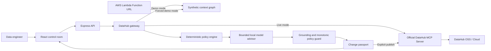

# Architecture

## System shape

The application is deliberately split at the `DataHubGateway` boundary. The agent does not know whether context came from the deterministic demo graph or a live MCP endpoint. This makes the full workflow reviewable without credentials while preserving a real production integration.

## Agent workflow

1. **Ground:** retrieve entity and schema context. A requested field absent from DataHub fails closed.
2. **Trace:** traverse downstream lineage and map field names across transformations.
3. **Assess:** combine change semantics with configured certification-tag signals, governance tags, owner count, and consumer class.
4. **Reason:** ask a local instruction model for a structured recommendation, cited risks, phase guidance, owner briefs, and open questions using only the bounded DataHub evidence packet.
5. **Guard:** reject unknown URNs, wrong-owner assignments, duplicate phases, malformed output, and provider failures. The model may maintain or tighten the deterministic verdict, never weaken it.
6. **Plan:** order work by lineage distance and enforce an additive compatibility phase.
7. **Verify:** generate structural and behavioral SQL checks tied to the selected dataset and target field.
8. **Route:** group impacted assets by their DataHub owners.
9. **Remember:** write the decision record back through `save_document` after explicit operator approval.

This is a hybrid agent: DataHub supplies authoritative context, deterministic code owns hard policy and executable artifacts, and a local model performs bounded synthesis that materially affects the final recommendation. The public Lambda is deliberately a deterministic preview and says so in the UI. The complete local/private path uses Ollama and requires no paid model API.

The model cannot change the retrieved graph, numeric score, validation SQL, rollout gates, owner identities, or write authorization. Its JSON must validate against a strict schema and every evidence reference must resolve to the current DataHub context. No chain-of-thought is requested or stored; provenance records provider, model, prompt version, generation timestamp, and an SHA-256 hash of the bounded input packet.

## Why DataHub is indispensable

Without DataHub, ChangeGuard cannot know:

- whether the field exists in the current schema;
- where a field is renamed or transformed downstream;
- which dashboards, financial artifacts, features, or models depend on it;
- who owns each migration step;
- which assets carry configured certification-tag, production-tag, PII, SOX, or revenue-critical signals;
- where to store the durable decision for future humans and agents.

A static SQL parser could infer part of one repository's table lineage. It cannot provide the cross-platform organizational graph represented here: PostgreSQL to Snowflake/dbt, Looker, Power BI, Feast, and MLflow with ownership and governance signals.

## Risk model

The score is bounded to 0-100 and is intentionally inspectable:

- base weight by change type: drop > type > rename > nullable;
- downstream asset count;
- distinct owner groups;
- critical governance tags such as SOX, board, production, revenue, and Tier-1;
- configured certification-tag signals;
- consumer usage and kind.

Asset-level severity is also calculated so an operator can distinguish a low-use staging table from a production model or audited finance dashboard.

## Trust boundaries

- Browser to API: validated JSON under a small request-size limit.
- API to MCP: bearer token exists only in the server process.
- MCP reads: failures are returned to the operator; no silent demo fallback in live mode.
- MCP writes: only a private deployment with `DATAHUB_ALLOW_MUTATION=true` and discovered `save_document` capability can publish.
- API to local model: evidence is projected and bounded; metadata is treated as untrusted data, output is schema-validated, and any model failure aborts the analysis.
- Public Lambda: constructs the simulated gateway directly, accepts same-origin or explicitly allowlisted browser origins, and cannot activate live DataHub mode.
- SQL: generated as reviewable text and never executed by ChangeGuard.

For SQL rendering, a DataHub PostgreSQL name `database.schema.relation` maps to the physical `"schema"."relation"` reference used after connecting to `database`. BigQuery `project.dataset.table` remains a single backtick-quoted path. Target type parsing uses dialect allowlists and rejects incompatible types before a passport is created.

## Production extension points

- Add a durable quota and authenticated ingress before enabling model-backed reasoning on any public deployment.
- Optionally add DataHub query history as a separately implemented and tested retirement signal.
- Attach CI results and deployment receipts to the DataHub decision document.
- Add organization-specific policy packs for data contracts, deprecation windows, and compliance sign-off.
