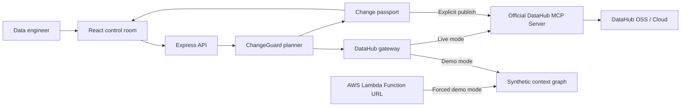

# Architecture

## System shape

The application is deliberately split at the `DataHubGateway` boundary. The agent does not know whether context came from the deterministic demo graph or a live MCP endpoint. This makes the full workflow reviewable without credentials while preserving a real production integration.

## Agent workflow

1. **Ground:** retrieve entity and schema context. A requested field absent from DataHub fails closed.
2. **Trace:** traverse downstream lineage and map field names across transformations.
3. **Assess:** combine change semantics with configured certification-tag signals, governance tags, owner count, and consumer class.
4. **Plan:** order work by lineage distance and enforce an additive compatibility phase.
5. **Verify:** generate structural and behavioral SQL checks tied to the selected dataset and target field.
6. **Route:** group impacted assets by their DataHub owners.
7. **Remember:** write the decision record back through `save_document` after explicit operator approval.

This is an agent because it observes catalog state, makes a bounded decision, generates an actionable plan, and mutates the shared context graph. It is deterministic by design: the same graph and proposal produce the same risk logic and plan structure. A paid LLM is neither required nor hidden behind the demo.

## Why DataHub is indispensable

Without DataHub, ChangeGuard cannot know:

- whether the field exists in the current schema;
- where a field is renamed or transformed downstream;
- which dashboards, financial artifacts, features, or models depend on it;
- who owns each migration step;
- which assets carry configured certification-tag, production-tag, PII, SOX, or revenue-critical signals;
- where to store the durable decision for future humans and agents.

A static SQL parser could infer part of one repository's table lineage. It cannot provide the cross-platform organizational graph represented here: PostgreSQL to Snowflake/dbt, Looker, Power BI, Feast, and MLflow with ownership and governance signals.

## Risk model

The score is bounded to 0-100 and is intentionally inspectable:

- base weight by change type: drop > type > rename > nullable;
- downstream asset count;
- distinct owner groups;
- critical governance tags such as SOX, board, production, revenue, and Tier-1;
- configured certification-tag signals;
- consumer usage and kind.

Asset-level severity is also calculated so an operator can distinguish a low-use staging table from a production model or audited finance dashboard.

## Trust boundaries

- Browser to API: validated JSON under a small request-size limit.
- API to MCP: bearer token exists only in the server process.
- MCP reads: failures are returned to the operator; no silent demo fallback in live mode.
- MCP writes: only a private deployment with `DATAHUB_ALLOW_MUTATION=true` and discovered `save_document` capability can publish.
- Public Lambda: constructs the simulated gateway directly, accepts same-origin or explicitly allowlisted browser origins, and cannot activate live DataHub mode.
- SQL: generated as reviewable text and never executed by ChangeGuard.

For SQL rendering, a DataHub PostgreSQL name `database.schema.relation` maps to the physical `"schema"."relation"` reference used after connecting to `database`. BigQuery `project.dataset.table` remains a single backtick-quoted path. Target type parsing uses dialect allowlists and rejects incompatible types before a passport is created.

## Production extension points

- Replace or augment deterministic scoring with an approved LLM while retaining schema and policy gates.
- Optionally add DataHub query history as a separately implemented and tested retirement signal.
- Attach CI results and deployment receipts to the DataHub decision document.
- Add organization-specific policy packs for data contracts, deprecation windows, and compliance sign-off.
